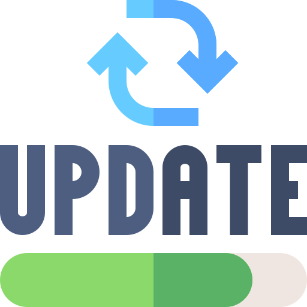

<h1>PluginUpdater</img>&nbsp;
</img></h1>
<br />

A PocketMine-MP Virion for automatically updates the plugin in poggit.

# Usage:

Installation is easy, you may get a compiled phar [here](https://poggit.pmmp.io/ci/DavidGlitch04/PluginUpdater/~), integrate the virion itself into your plugin or you could also use it as a composer library by running the command below:

`composer require davidglitch04/pluginupdater`

### Configuration
To have the plugin automatically update when a new update is available, copy the following to your defaults `config.yml`.

```yaml
AutoUpdater:
  # Current version of the plugin
  "version": "1.0.0-beta"
  # Link to get new update information
  "url": "https://raw.githubusercontent.com/<Username>/<Repositories>/<Branches>/poggit_news.json"
  # This section helps users to turn off autoupdate
  "enable": true
```
### Update information
In order for the plugin to automatically download new plugin updates, create a file `poggit_news.json` in the repositories.

```json
{
  "version": "1.0.0",
  "time": 1652576220,
  "link": "Release link",
  "download_link": "Download link",
  "patch_notes": "Note of new version"
}
```
"version" is the latest version of the plugin </br>
"time" is time to release a new version</br>
"link" is the link of the new version
"download_link" is the link for the plugin to download the update, for example: `https://poggit.pmmp.io/r/175835/iLand_dev-66.phar` </br>
"patch_notes" is the information of the new version

### Initialization and Finalization

```php
use pocketmine\plugin\PluginBase;
use davidglitch04\PluginUpdater\PluginUpdater;

class Main extends PluginBase
{
    public function onEnable() : void{
        $PluginUpdater = PluginUpdater::checkUpdate($this, $this->getConfig()->get("AutoUpdater"));
        $PluginUpdater->check();
    }
}
```